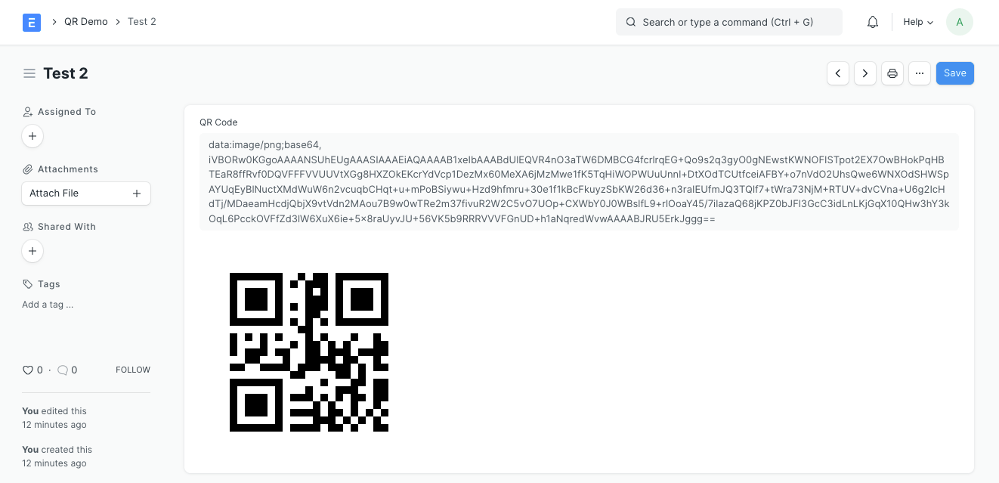
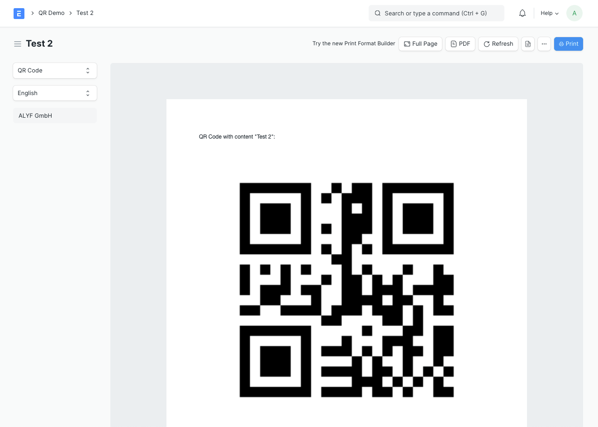
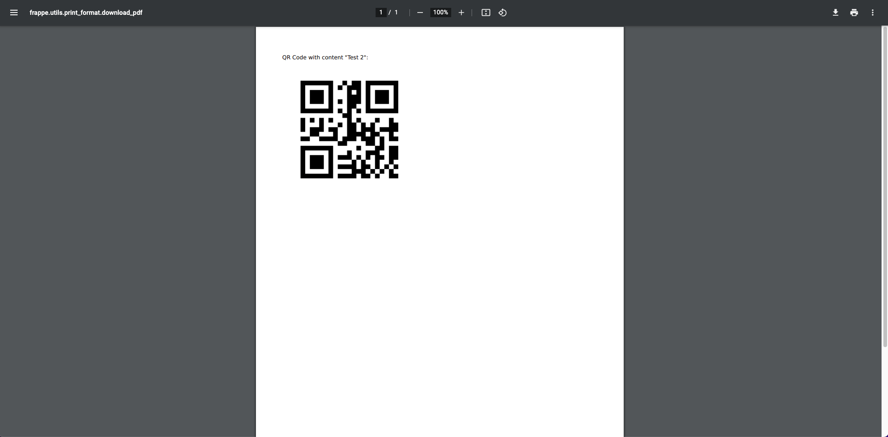

## QR Demo

Demo app for printing QR Codes.

This app contains a DocType **QR Demo**. You can create a new **QR Demo**, fill the _Title_ field and save.

In the backend, the title is converted to a QR code image with these steps:

1. Create QR code, using https://pypi.org/project/qrcode/
2. Convert the raw bytes of QR code to a base64 encoded string
3. Add info about filetype and encoding for the browser
4. Save the QR Code data in the field _QR Code_



The **QR Demo** DocType also has a field _QR Image_, which just displays the data stored in _QR Code_.

> Note: In a production application, you'll want to set the field _QR Code_ as hidden, so the user doesn't see the raw data.

Try to print the document, using the print format "QR Demo". The QR code will work flawlessly in print preview and PDF. The print format is very simple. It uses the data from _QR Code_ like this:

```jinja
<p>QR Code stored in field <i>QR Code</i>:</p>

```

For cases when we need dynamic QR codes, that are not stored in the document, we can generate them ad-hoc by calling `get_qr_code` in the print format:

```jinja
<p>QR Code generated ad-hoc:</p>

```

We achieved this by adding the `get_qr_code()` method to the `jinja` configuration in our `hooks.py` file, like this:

```python
jinja = {
	"methods": [
		"qr_demo.qr_code.get_qr_code"
	],
}
```

### Print Preview


### Print PDF

